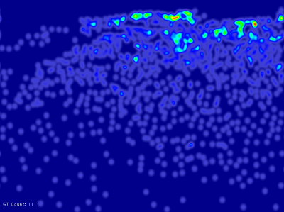

# MCNN_in_Keras
keras实现的人群数量估计网络["Single Image Crowd Counting via Multi Column Convolutional Neural Network"](https://www.cv-foundation.org/openaccess/content_cvpr_2016/papers/Zhang_Single-Image_Crowd_Counting_CVPR_2016_paper.pdf)，持续改进中...

## 安装
1. Clone
    ```shell
    git clone https://github.com/ybcc2015/MCNN_in_Keras.git
    ```

2. 安装依赖库
    ```shell
    cd MCNN_in_Keras
    pip install -r requirements.txt
    ```

## 数据配置
1. 下载ShanghaiTech数据集:    
    [Dropbox](https://www.dropbox.com/s/fipgjqxl7uj8hd5/ShanghaiTech.zip?dl=0)
    or [百度云盘](http://pan.baidu.com/s/1nuAYslz)

2. 创建数据存放目录
    ```shell
    mkdir ./data/original/shanghaitech/
    ```

3. 将```part_A_final```和```part_B_final```存放到./data/original/shanghaitech/目录下

4. 生成测试集的ground truth文件
    ```shell
    cd data_preparation
    python create_gt_test_set_shtech.py [A or B]  # Part_A or Part_B
    ```
    生成好的ground-truth文件将会保存在./data/original/shanghaitech/part_【A or B】_final/test_data/ground_truth_csv目录下
    
5. 生成训练集和验证集
    ```shell
    cd data_preparation
    python create_training_set_shtech.py [A or B]
    ```
    生成好的数据保存将会在./data/formatted_trainval_【A or B】目录下

6. 生成热力图  
    如果你想生成测试集的ground truth热力图：
    ```shell
    python create_heatmaps.py [A or B]
    ```
    生成好的热力图将会保存在./heatmaps_gt目录下

>2~6步均在工程根目录下操作

## 测试
在./trained_models目录中存放了已经训练好的模型，你可以直接用来测试：
```shell
python test.py [A or B]
```
测试结果将会保存在./output_【A or B】目录下

## 训练
如果你想自己训练模型，很简单：
```shell
python train.py [A or B]
```
训练好的模型将会保存在./trained_models目录下

## 结果

    |        |  MAE   |  MSE   |
    ----------------------------
    | Part_A |  154.4 |  221.9 |
    ----------------------------
    | Part_B |  33.1  |  56.9  |

**Part_A**   
原图：  
   
Ground Truth (1111) & Estimate (1256)：  
&nbsp;

**Part_B**   
原图：  
   
Ground Truth (252) & Estimate(242)：  
&nbsp;
 